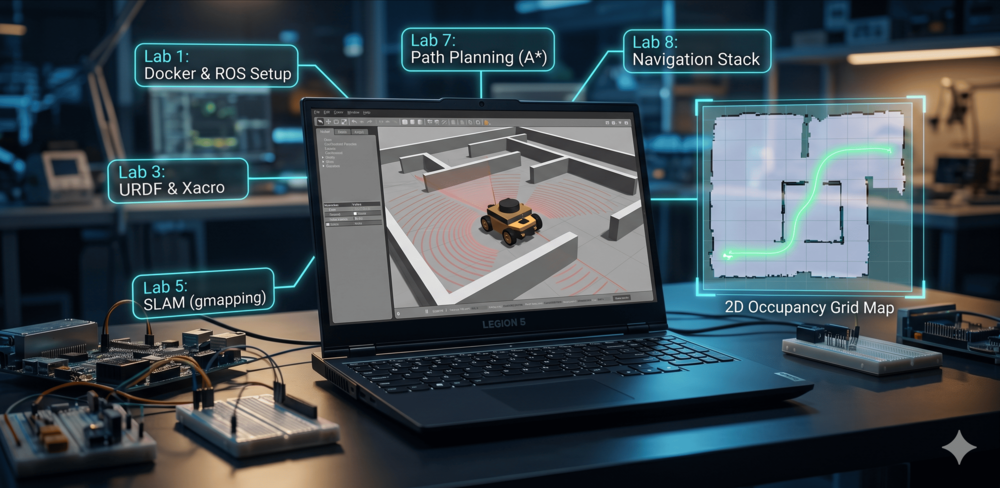

# ROS Robotics Labs 🤖🦾

A series of 8 hands-on labs covering ROS (Robot Operating System) fundamentals through autonomous robot navigation — from environment setup and URDF modeling to SLAM, localization, and a full navigation stack.

<div align="center">
  
</div>

<br>
<div align="center">
  <a href="https://codeload.github.com/TendoPain18/ros-robotics-labs/legacy.zip/main">
    
  </a>
</div>

## 📋 Description

These labs were developed as part of a robotics workshop series. Each lab builds on the previous one, taking you from a fresh Ubuntu/ROS install all the way to a fully configured autonomous navigation system running on TurtleBot3 in Gazebo. Every lab includes theory, step-by-step instructions, code, and ROS packages.

---

## 🧪 Labs Overview

### Lab 1 — ROS Foundations

**Topics:** Docker, Ubuntu 20.04 setup, ROS Noetic installation, Linux shell commands, ROS workspace and packages, nodes, topics, messages, publishers, subscribers, and launch files.

**Key concepts:** `catkin_make`, `roscore`, `rosrun`, `roslaunch`, `rostopic`, `rosmsg`, `package.xml`, `CMakeLists.txt`, publisher/subscriber pattern with Turtlesim examples.

---

### Lab 2 — Gazebo Simulation

**Topics:** Gazebo simulator, coordinate systems, TurtleBot3 simulation in Gazebo worlds.

**Key concepts:** Launching Gazebo, spawning TurtleBot3 models (Burger / Waffle), teleop keyboard control, pre-built worlds.

---

### Lab 3 — URDF Robot Modeling

**Topics:** URDF (Unified Robot Description Format), links, joints, visual/collision/inertial elements, Xacro macros.

**Key concepts:** `<link>`, `<joint>`, geometry types (box, cylinder, sphere, mesh), joint types (fixed, revolute, continuous, prismatic), Xacro properties and macros for reusable robot descriptions.

---

### Lab 4 — TF, Robot State Publisher & Gazebo Plugins

**Topics:** Coordinate frame transformations (TF2), Robot State Publisher, Joint State Publisher, differential drive plugin, 2D LiDAR plugin.

**Key concepts:** `tf_echo`, `rqt_tf_tree`, `static_transform_publisher`, spawning URDF in Gazebo, `libgazebo_ros_diff_drive.so`, `libgazebo_ros_laser.so`, `teleop_twist_keyboard`.

**ROS Package:** `robot_description` — includes Xacro URDF, launch files, and a 2D LiDAR STL mesh.

---

### Lab 5 — SLAM with Gmapping

**Topics:** SLAM theory (Full SLAM vs. Online SLAM), occupancy grid maps, log-odds representation, Bayesian updates, FastSLAM particle filter, loop closure, Gmapping ROS package, map saving.

**Key concepts:** `slam_gmapping` node, `/scan` and `/tf` inputs, `/map` output, `map_server`, saving maps as `.pgm` + `.yaml`, tuning Gmapping parameters (particles, map resolution, update intervals).

**Pre-lab:** TurtleBot3 Noetic simulation setup with `robot_state_publisher` and `joint_state_publisher`.

---

### Lab 6 — Monte Carlo Localization (AMCL)

**Topics:** MCL algorithm, particle filter theory, global vs. local localization, Bayes filter, AMCL ROS package.

**Key concepts:** Particle initialization, motion update, sensor update (likelihood field model), resampling, AMCL parameters (min/max particles, KLD sampling, laser model, odometry model), integration with a saved map.

---

### Lab 7 — Path Planning

**Topics:** Global path planning (Dijkstra, A*), local motion control (Dynamic Window Approach), comparison of algorithms.

**Key concepts:** Dijkstra's uniform-cost search, A* heuristic function `f(n) = g(n) + h(n)`, DWA velocity sampling and trajectory scoring, dynamic obstacle handling.

---

### Lab 8 — ROS Navigation Stack

**Topics:** Full `move_base` navigation stack, global and local costmaps, global planner (A*/Dijkstra), local planner (DWA), obstacle avoidance, rotate-recovery behavior.

**Key concepts:** `move_base` node, `AMCL` localization, costmap layers (static, obstacle, inflation), configuration YAML files for costmaps and planners, `cmd_vel` output, goal sending via RViz.

**ROS Package:** `navigation` — includes `move_base`, `amcl` launch files, costmap/planner config YAMLs, pre-built maps, and RViz configs.

---

## 📁 Repository Structure

```
ros-robotics-labs/
├── Lab-1/               # ROS Foundations
│   ├── Docker-guide.md
│   ├── ros-installation.md
│   ├── ros-intro.md
│   └── shell-cmd.md
├── Lab-2/               # Gazebo Simulation
│   └── gazebo-simulation.md
├── Lab-3/               # URDF Robot Modeling
│   └── URDF.md
├── Lab-4/               # TF & Gazebo Plugins
│   ├── Lab4.md
│   └── robot_description/   # ROS package (Xacro URDF + launch files)
├── Lab-5/               # SLAM with Gmapping
│   ├── Slam.md
│   ├── gmapping.md
│   └── Pre-lab.md
├── Lab-6/               # Monte Carlo Localization
│   └── MCL.md
├── Lab-7/               # Path Planning
│   └── pathPlanning.md
└── Lab-8/               # Navigation Stack
    ├── Navigation.md
    └── navigation/          # ROS package (move_base + AMCL + config)
```

## 🚀 Getting Started

**Requirements:**
- Ubuntu 20.04
- ROS Noetic
- Gazebo (comes with ROS Noetic desktop-full)

**Quick setup:**
```bash
# Install ROS Noetic
sudo sh -c 'echo "deb http://packages.ros.org/ros/ubuntu focal main" > /etc/apt/sources.list.d/ros-latest.list'
sudo apt install ros-noetic-desktop-full

# Create workspace
mkdir -p ~/catkin_ws/src && cd ~/catkin_ws
catkin_make
echo "source ~/catkin_ws/devel/setup.bash" >> ~/.bashrc

# Clone this repo into your workspace
cd ~/catkin_ws/src
git clone https://github.com/TendoPain18/ros-robotics-labs.git

# Install TurtleBot3 (needed for Labs 5-8)
sudo apt install ros-noetic-turtlebot3-simulations ros-noetic-turtlebot3-gazebo
sudo apt install ros-noetic-slam-gmapping ros-noetic-map-server ros-noetic-amcl ros-noetic-move-base
```

Start with **Lab 1** and follow the labs in order — each builds on the previous.

## 🤝 Contributing

Contributions are welcome! Feel free to add new labs, improve explanations, fix typos, or add exercises.

## 🙏 Acknowledgments
- Zewail City of Science and Technology

<br>
<div align="center">
  <a href="https://codeload.github.com/TendoPain18/ros-robotics-labs/legacy.zip/main">
    
  </a>
</div>

## <!-- CONTACT -->
<!-- END CONTACT -->

## **From zero to autonomous navigation — one lab at a time! 🤖✨**
